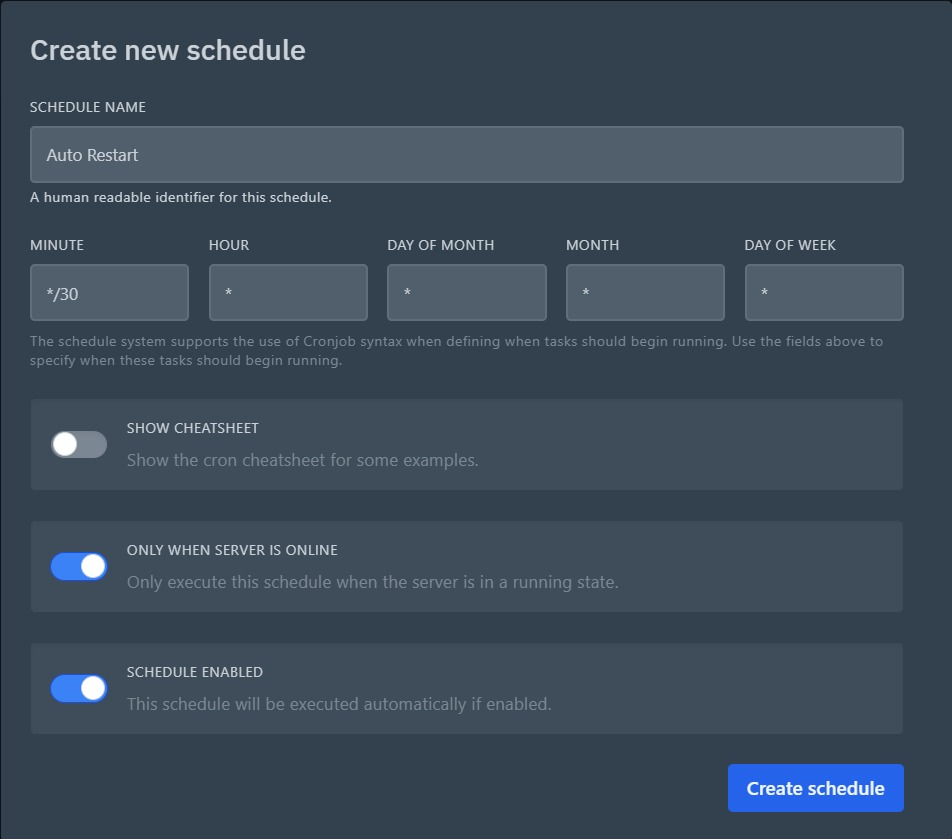
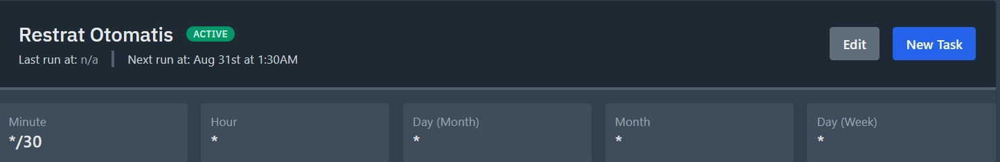

<!-- Banner -->
<h1 align="center">🤖 BOT WhatsApp Reminder Tugas 📚</h1>
<p align="center">
  Bot WhatsApp sederhana untuk mengingatkan tugas otomatis menggunakan <b>Node.js</b></b>
</p>
<p align="center">
  Jika ingin bot berjalan dengan semestinya baca sampai akhir <b>(📝 Note Penting !)</b>
</p>

---

## 🚀 Fitur
- Kirim reminder otomatis ke WhatsApp (Group)
- Bisa melihat tugas apa saja yang sedang berlangsung
- Bisa melihat Jadwal Pelajaran dengan gambar (database/pusat/image/jadwal.jpeg)
- Bisa mengatur waktu sesuai lokasi yang anda pilih, agar tidak salah waktu dalam mengirim jadwal otomatis (node-cron)
- Otomatis menghilang saat melewati deadline/tenggat waktu
- Mudah dikembangkan

---

## ⚡ Command Bot
- .menu - Untuk melihat menu bot
- .autoreminder on/off - Aktifkan/Nonaktifkan Auto Reminder pada group tertentu
- .addtugas - Untuk menambahkan tugas
- .deltugas - Untuk menghapus tugas
- .tugas - Untuk melihat tugas yang sedang berlangsung
- .addpengurus - Menambah pengurus agar bisa mengakses perintah <b>.addtugas/.deltugas</b>
- .delpengurus - Menghapus pengurus

---

## ⚙️ Konfigurasi Database / Settings

File konfigurasi berada di:  
database/settings.json

```
// Bot Settings
global.owner = ['628'] // Owner Number
global.developer = "GregXYZ" // Dev Name
global.zonaWaktu = "Asia/Makassar" // Waktu Auto Reminder

/*
Note:
Asia/Pontianak = WIB
Asia/Makassar = WITA
Asia/Jayapura = WIT
*/

global.reminder= "0 8 * * *" // Setiap jam 8:00

/*
Note:
"0 8 * * *"
0 = Menit - 8 = Jam = 8:00

"30 7 * * *"
30 = Menit - 7 = Jam = 7:30
*/
```

---

## 🔧 Cara Menjalankan
Clone repo ini:
```bash
git clone https://github.com/username/BOT-WHATSAPP-REMINDER-TUGAS.git
cd BOT-WHATSAPP-REMINDER-TUGAS
```
Install package:
```
npm install
```
Jalankan Bot:
```
node index.js
```
atau
```
npm start
```
---

## 📝 Note Penting !
Disarankan untuk menjalankan bot menggunakan **Panel Pterodactyl** dan mengatur jadwal restart bot di menu **Schedules** agar terhindar dari *bad session* yang tidak diketahui.

---

### 🔄 Cara Mengatur Restart Otomatis
1. Buka menu **Create New Schedule** dan atur waktu sesuai kebutuhan (misalnya setiap 30 menit).  
   <p align="center">
     
   </p>

2. Setelah itu, buat **New Task**
   <p align="center">
     
   </p>

3. Masukan option seperti di gambar berikut ini:
   <p align="center">
     
   </p>

4. Tinggal click **Create Task** dan **Save**

---

